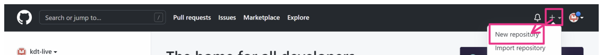
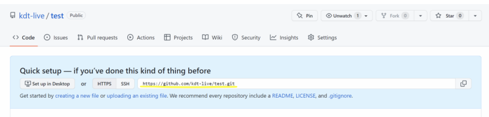

Day3
# **원격 저장소**
## 개념
> 분산버전관리 시스템에서 협업할 때 사용하는 저장소 , 원격 저장소(remote repository)

## 종류
- github
- gitlab
- bitbucket

## 활용 명령어
- **$ git push**
    - **로컬** 저장소의 버전을 **원격** 저장소(origin)로 보냄.
- **$ git pull**
    - **원격** 저장소의 버전을 **로컬** 저장소로 가져옴.
- **$ git clone**
    - 새로운 프로젝트에 참여하고자 할때 모든 버전을 가져온다. 
- **$ .gitignore**
    - 버전 관리랑 상관 없는 파일 , git  파일/폴더 등을 관리 x
    - 이미 커밋한 것은?  commit history(커밋 역사) : 삭제한 기록들은 남는다.

 

# **Github 기반 원격저장소 활용**
## **초기 원격저장소 설정**
1. New Repository 생성
    

2. 저장소 설정

3. URL 확인 
- https://github.com/Github USER NAME/저장소이름.git

4. 로컬 저장소에 원격 저장소 정보 설정 
- 원격 저장소 추가
    > **$ git remote add <원격저장소 이름> <URL>**

            - remote : 원격저장소
            - add : 추가해
            - origin : origin으로

            - 파라미터
                - 원격 저장소 이름 => origin

- 원격 저장소 삭제
    > **$ git remote rm <원격저장소 이름>**

 

5. 원격 저장소의 정보 확인 
    > **$ git remote -v**

- 결과
    - origin https://github.com/Github USER NAME/저장소 이름.git (fetch)
    - origin https://github.com/Github USER NAME/저장소 이름.git (push)

 - 파라미터
    - origin : 원격저장소 이름 ( 많이 쓰는 이름이 origin이다.)
    - https://github.com/Github USER NAME/저장소 이름.git  : URL

 

## **로컬 저장소의 버전을 원격 저장소로 올리기**
> **$ git push <원격저장소 이름> <브랜치 이름>**

- 파라미터
    - 원격 저장소 이름 => origin
    - 브랜치 이름 => master / main 중 하나

 

## **원격 저장소로부터 버전을 로컬 저장소로 가져오기**
>**$ git pull <원격저장소 이름> <브랜치 이름>**

- 파라미터
    - 원격 저장소 이름 => origin
    - 브랜치 이름 => master / main 중 하나

 

## **새로운 프로젝트에 참여하고자 할때** 
=> **원격저장소를 복제** 
> **$ git clone <원격저장소 주소>**
 

**! 혼동 주의!**
- Download ZIP : 가장 최신 버전의 상태 파일만 받는것
-  clone : git 저장소를 받아오는 것, 모든 버전을 받은 것일 뿐

 

- git **init** : **로컬**에서 새로운 프로젝트 시작 => **생성**
- git **clone** : **원격**에 있는 프로젝트 시작 => **복제**

 

## **push 실패했을 때** 
- 원인 : 로컬과 원격 저장소의 커밋 이력이 다를 때 
- **해결방법**
    - 같은 파일을 수정한 경우 => merge conflict
    - 다른 파일을 수정한 경우 => push conflict
        1. 원격저장소의 커밋을 로컬저장소로 가져옴
        2. 로컬에서 두 커밋 병함
        3. 다시 push

 

## **버전관리와 상관없는 파일 처리** 
> git 저장소에 **.gitignore 파일**을 **생성**해 해당 내용 관리

[gitignore url](https://www.google.com/url?q=https://github.com/github/gitignore&sa=D&source=apps-viewer-frontend&ust=1672300144077291&usg=AOvVaw0Mq_dKVz0Ya98UzEEzZOAs&hl=ko)

- 예시
    - 파일 : 폴더명/파일명.txt
    - 디렉토리 : /디렉토리명
    - 확장자 : *.exe
    - 예외 처리 : !b.exe

 **!이미 커밋된 파일은 반드시 삭제하기! 프로젝트 시작전에 미리 설정 추천!**

 

## **버전 업데이트 실행 코드 예시**
1. git init
2. git add 파일명
3. git commit -m '메시지'
4. git remote add origin https://github.com/Github username/저장소이름.git 
5. git push origin master

< **파일 내용 수정시** >

6. 파일 수정
7. git add 파일명
8. git commit -m '메시지' 
9. git push origin master (또는 git push --set-upstream origin master)

**git status/ git log 를 사용해 수시로 상태 확인**

 

# 관련 질문
- Github에 파일을 추가하고 싶어요 & 파일이 잘못 올라갔는데 삭제하고 싶어요 
    - 삭제된 버전을 만들고 push하세요
- Github에 올리고 로컬에서 파일을 지우면 사라지나요? 
    -  사라지지는 않지만, 삭제 상태를 add, commit해서 버전으로 기록하고 push하면 삭제된 버전으로 업로드 된다. 
     
    
    **결국 로컬에서 지워도 git에 지운 버전을 push하지 않는다면 Github에서 사라지지 않는다.**

 

## 오늘은 여기까지.. 다음에 더 공부해보자
- 초심자용) https://backlog.com/git-tutorial/kr/intro/intro1_1.html
- Git 완벽 책) https://git-scm.com/book/ko/v2/%EC%8B%9C%EC%9E%91%ED%95%98%EA%B8%B0-%EB%B2%84%EC%A0%84-%EA%B4%80%EB%A6%AC%EB%9E%80%3F