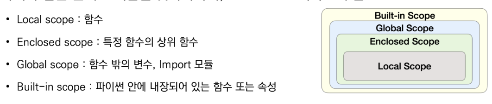

# **사용자 정의 함수**

## **함수 기본 구조**
- 선언과 호출
- **입력**
- 범위
- 결과값 (=**출력**)

<br/>

## return

- 만일 return이 두개라면 첫번째만 실행된다.

    ```python
    def cub(x):
        return x**3
        return x**2
    print(cub(2)) #8
    print(cub(3)) #27
    ```
- return문 없는 경우 : None
- 여러 값을 return 하는 경우 : tuple

<br/>

## 객체 수명주기
    - `built-in scope` : 파이썬 실행된 이후부터 영원히 유지 => 예) 내장함수
    - `global scope` : 모듈이 호출된 시점 이후 혹은 인터프리터가 끝날 때까지 유지
    -` local scope` : 함수가 호출될 때 생성되고, 함수가 종료될 때까지 유지
    - `enclosed` : local scope를 감싸고 있는 local scope



<br/>

## global에 있는 변수를 local에서 쓰고 싶을 때
=> **global 변수명**

