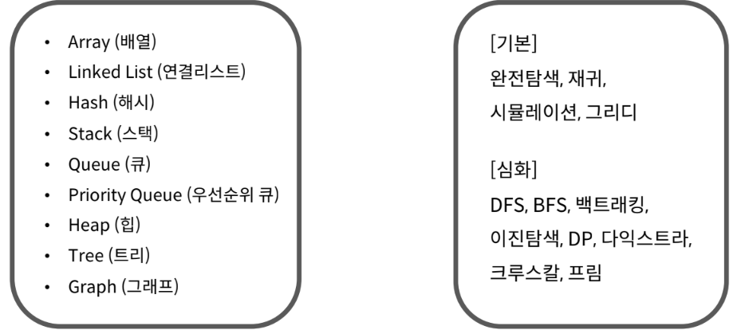

# 개념
- 프로그램 : 데이터구조 + 알고리즘
- 알고리즘 : 어떤 문제를 해결하기 위해 정해진 일련의 절차나 행동
- 코딩 테스트 : 기업에서 지원자를 대상으로 코딩을 통한 알고리즘 기반 문제 해결 능력을 테스트 하는 것

 

# 코딩 테스트
- ***의도*** 
    - 문제 의도 정확히 파악? , 적절한 해결 방법 적용가능?
    - 해결방법을 프로그래밍을 통해 능숙하게 구현가능?

 

- ***유형***
    - 온라인
    - 오프라인 
        - 개발형 코딩테스트
        - 화이트보드 손코딩 
            - 논리, 과정, 커뮤니케이션 스킬 평가
    - 기업별
        
 

- ***준비하기***
    - 많이 풀기
    - ***평소***에는 ***같은 유형***을 단기간에 여러 번 반복하고, ***코테 직전***에는 모의고사처럼 시간 제한을 두고 ***여러 유형*** 풀기!!
    - 오랜 시간 고민했을때 풀리지 않는다면, 답을 봐라!! 최대한 타인의 답을 많이 보면서 여러 풀이를 습득해라!!
    - 성장시킬 수 있는 300~350문제 대부분 코딩테스트 통과한다.
        
 

- ***꿀팁!!!***
    - `변수명` 대충 짓지 않기
    - 언어가 가지는 `내장 함수, 라이브러리` ***적극 활용***
    - `반복`되는 코드는 `함수화`
    - ***풀이***를 남에게 `설명`하는 연습 반드시 필요!
    - 문제를 `접근하는 방법`을 가다듬자!!
    
 

# 개발자 : 문제해결을 하는, 기술을 좀 아는 사람
    백준이랑 sw아카데미를 할 것이다.
    프로그래머스는 스터디의 장으로 열어둘 것이다.
    프로그래머스, 백준 : 취업의 장  
    leetcode : 해외취업
    
 

# 데이터 구조 & 알고리즘
    - 데이터 구조 : 다양한 방식으로  데이터 저장 + 조작 기능 제공

 

# 입력

`input()`
- [f-killer metoring자료 참고!](https://github.com/whatareyoudoingz/f-killer/blob/master/1111_6%EC%B0%A8_%EB%A9%98%ED%86%A0%EB%A7%81_%EC%9E%90%EB%A3%8C.mdhttps://github.com/whatareyoudoingz/f-killer/blob/master/1111_6%EC%B0%A8_%EB%A9%98%ED%86%A0%EB%A7%81_%EC%9E%90%EB%A3%8C.md)
- 문자열 입력
    a=input()
- 한 개 숫자 입력
    b=int(input())
- 여러 개 숫자 입력
    d,e=map(int,input().split())

 

# 출력

`print()`
- 파라미터 
    - end : 출력 끝에 넣을 인자 
    - sep : 출력할때 구분할 인자

