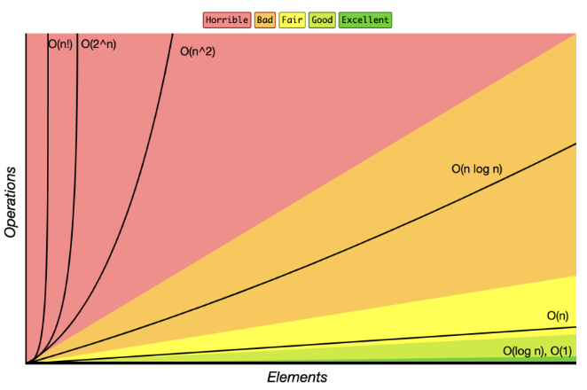

# 시간복잡도
- 기준 : O (Big O) 표기법
- 목적 : 알고리즘을 구현하는 데 드는 CPU(시간)을 비교하기 위해
- 정의 : 알고리즘의 수행시간
    - 높다 => 느린 알고리즘 / 낮다 => 빠른 알고리즘
- 계산방법
    - if문 : if,else 밑의 줄 코드의 시간복잡도 중 최대
    - 반복문 : N번 실행 (for i in range(N):)
        - 중첩반복문 : M*N번 실행 ( for i in range(N): for j in range(M):)
- 종류

# 배열
- 여러 데이터들이 ***연속된 메모리 공간***에 저장되어 있는 자료구조
- 길이 변경 불가
- 데이터 타입 고정

# 연결리스트
- 데이터가 담긴 여러 ***노드***들이 ***순차적으로 연결***된 형태의 자료구조
- 데이터가 메모리에 연속 저장 x
- 길이 변경 가능
- 데이터 타입 고정 X
- ***순차적 탐색***

# 리스트
- 배열과 연결리스트의 최강버전
- 메서드 [참고](https://github.com/whatareyoudoingz/f-killer/blob/master/1029_2%EC%B0%A8_%EB%A9%98%ED%86%A0%EB%A7%81_%EC%9E%90%EB%A3%8C.md)
    - .append()
    - .pop()
    - .count()
    - .index()
    - .sort()
    - .reverse()
- 이용 방법
    - 별도의 리스트에 추가하거나, 관리하는 형태
    - 인덱스로 접근해서 값 변화
    - 리스트 copy