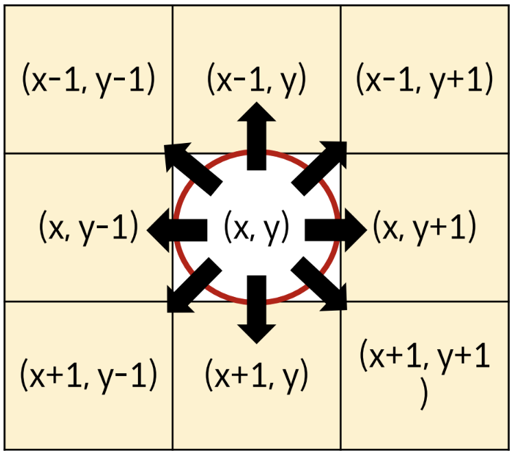

# 완전 탐색 (Exhaustive Search)

```python
matrix=[
    [1,2,3,4],
    [5,6,7,8],
    [9,8,0,1]
]
print(list(zip(*matrix)))

'''
[(1, 5, 9), (2, 6, 8), (3, 7, 0), (4, 8, 1)]
'''

print(matrix[::-1])

'''
[[9, 8, 0, 1], [5, 6, 7, 8], [1, 2, 3, 4]]
'''

print(list(zip(*matrix[::-1])))

'''
[(9, 5, 1), (8, 6, 2), (0, 7, 3), (1, 8, 4)]
'''

```

<br/>

---
## 무식하게 풀어보자~~ (Brute-force)
- 모든 경우의 수 탐색
- 예제) 블랙잭
```python
n,m=map(int,input().split())
number=list(input().split())

max=0
for i in range(n-2):
    for j in range(i+1,n-1):
        for k in range(j+1,n):
            tot=int(number[i])+int(number[j])+int(number[k])
            if max <  tot and tot <= m:
                max=tot
print(max)
```
<br/>

---
## 델타 탐색 (Delta Search)
- 이차원 리스트 완전탐색 (`상하좌우` 탐색)
    
    상 : (i-1,j) 하 : (i+1,j) 좌 : (i,j-1) 우 : (i,j+1)

    

