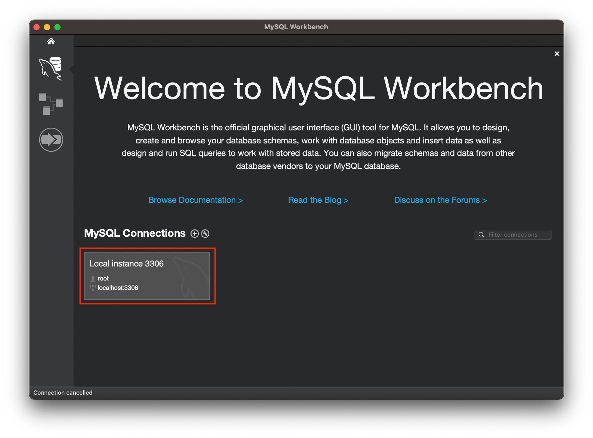
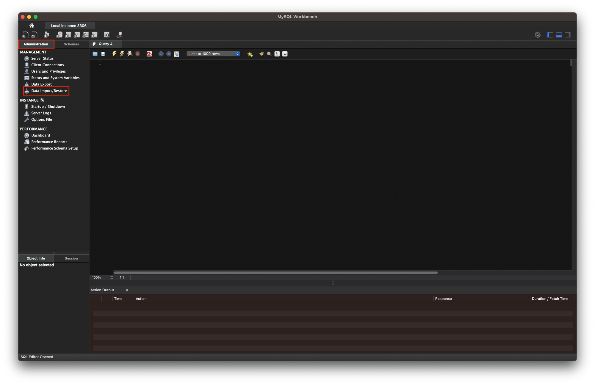
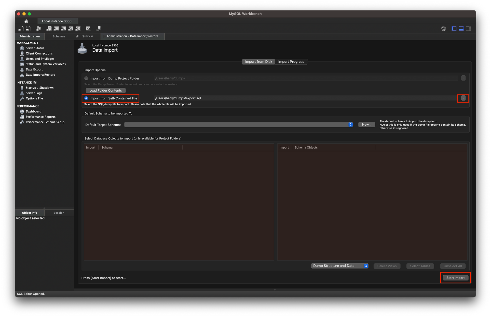

*데이터베이스를 배우기 앞서 사용할 MySQL 과 MySQL Workbench를 설치하자!!*

## MySQL

> mysql 설치
1. 터미널 열기
2. `conda activate` 가상환경 이름 
* homebrew 미설치시 homebrew 설치 [링크](https://brew.sh/index_ko)
3. `brew install mysql`
4. `my sql --version`  => 8.0.32버전 설치 확인
> mysql 실행
-  `mysql.server start` => Starting MySQL SUCCESS! 화면 확인
> mysql 보안 설정
-  `my_secure_installation`
> mysql 비밀번호 복잡성 유무 결정

> mysql 비밀번호 설정

> mysql 사용자 설정
- 익명 사용자를 삭제할 것인지 설정
> mysql 원격 접속 설정 
- 다른 IP에서 root 아이디로 원격 접속 허용할 것인지 설정
> mysql 권한 적용 여부 설정 
- 권한 변경시 테이블에 적용 여부 설정

 

## MySQL  Workbench
> MySQL Workbench 설치
https://downloads.mysql.com/archives/workbench/

 

## mysql 서버 종료
- `mysql.server.stop`  => Shutting down MySQL SUCCESS! 화면 확인
 

# MySQL Workbench 활용법
## 데이터베이스 업로드 방법

- `Scehmas` 누른 후  데이터 확인하기

 

## 쿼리문 작성 및 퀴리 실행
1. 데이터베이스 선택
2. `Query` 에디터 선택
3. 퀴리문 작성 및 실행

