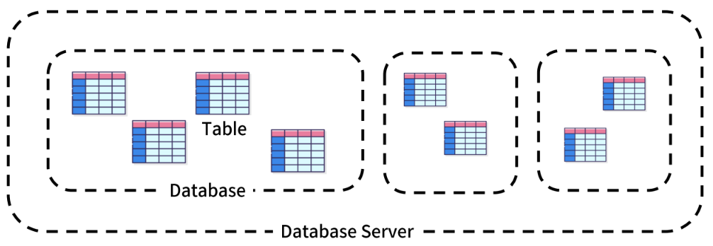

# 데이터베이스

## 데이터 
저장이나 처리에 효율적인 형태로 변환된 정보
 
- 과거의 저장방식 
    - 파일 : 어디서나 쉽게 사용 but 구조적 관리 어려움
    - 스프레드 시트 : 구조적 관리 가능 but 빅데이터 대응 어려움

- 현대의 저장방식 : **데이터베이스**  
    `빅`데이터 CRUD(`저장, 조회, 갱신, 삭제`)

  

 ---

 ## 관계형 데이터베이스(Relational Database)
    데이터 간에 관계가 있는 데이터 항목들의 모음

- 테이블, 행, 열 정보 구조화
- 데이터 간에 관계가 있는 데이터 연결(이에 대한 액세스 제공)
- 예시
    - 기본 키 (Primary Key, 고유한 식별 값): 이름
    
- 관련 용어
    - `Table` (aka Relation)​ : 데이터를 기록하는 형태틀
    -` Field` (aka Column, Attribute)​ : 고유한 데이터 형식(타입)이 지정되는 곳 (`열`)
    - `Record` (aka Row, Tuple)​ : 구체적인 데이터 값이 저장되는 곳 (`행`)
    - `Database` (aka Schema) : table의 집합체
    - `Primary Key`(PK) : 기본키 , 각 레코드의 식별자
    - `Foreign Key`(FK) : 외래키, `다른 테이블의 레코드를 식별할 수 있는 키`, 서로 다른 테이블 간의 관계를 만드는 데 사용

 

---

## RDBMS
- **관계형** 데이터베이스를 관리하는 소프트웨어 프로그램
- 데이터베이스와 사용자 간의 인터페이스
- 각 RDBMS별로 독자적인 기능에 따라 표준을 벗어나는 문법 존재
- 종류
    - Oracle Database
    - **MySQL**
        - 다양한 운영체제에서 실행 가능
        - 다양한 API 제공
        - **My SQL Workbench** Tool을 통해 GUI제공
        - 구조 : 테이블 < 데이터베이스 < 데이터베이스 서버(MySQL)
            
    - MS SQL Server
    - PostgreSQL
    - MongoDB
    - etc...