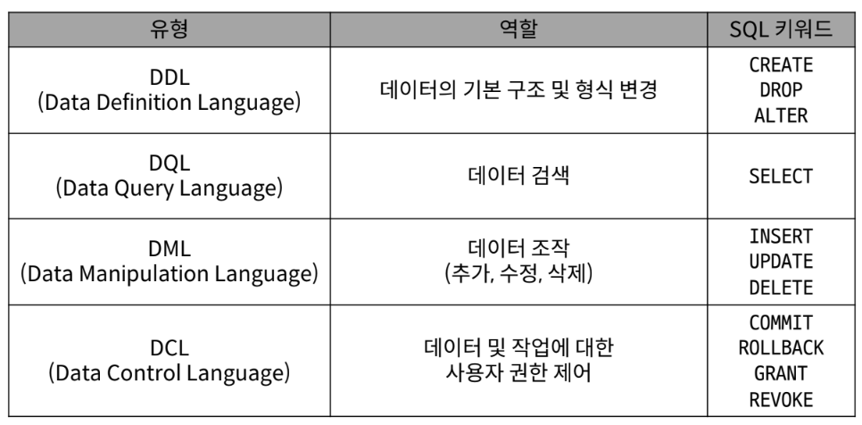

# SQL (**Structure** Query Language)
- 테이블 형태로 `구조화`된 `관계형 데이터베이스`에게 요청을 `질의`하는 언어
- 데이터베이스에 정보를 **저장,처리**하기 위한 프로그래밍 언어
- 데이터베이스와 상호작용하고 데이터베이스에서 데이터를 반환하기 위한 언어
    - Query 
        - 데이터베이스로부터 정보를 요청(질의, 질문)하는 것

## SQL 문법 규칙
- sql 명령어는 대소문자 구분 없음.
- 각 SQL Statements의 `끝`에는 `세미콜론(;}`이 필요함.
    - `SQL Statements` : SQL 언어를 구성하는 가장 기본적인 코드 블록
        
        1. **Querying data** => `SELECT`
            - **모든** 컬럼의 데이터 구하고 싶을 때 => `*`
                ```
                SELECT
                    *
                FROM
                    table_name ;
                ```
            - **특정** 컬럼의 데이터 구하고 싶을 떼
                ```
                    SELECT
                        select_list 
                    FROM
                        table_name ;
                ```
            - 특정 컬럼의 데이터 구하고 싶고,  **그 컬럼의 이름을 바꾸고 싶을** 때 =>   `AS`
                ```
                    SELECT
                        select_list AS '이름'
                    FROM
                        table_name ;
                ```
        2. **Sorting data** => `ORDER BY`
            - 특정 컬럼의 데이터를 기준으로 정렬하고 싶을 때
                ```
                    SELECT
                        select_list AS '이름'
                    FROM
                        table_name 
                    ORDER BY
                        column1 [ASC or DESC],
                        column2 [ASC or DESC] ;
                ```
        3. **Filtering data** 
            - **중복**된 데이터를 **제거**하고 싶을 때 => `DISTINCT`
                ```
                    SELECT DISTINCT
                        select_list AS '이름'
                    FROM
                        table_name ;
                ```
            - 특정 컬럼의 **특정 검색 조건을 지정**하고 싶을 때 => `WHERE`
                ```
                    SELECT DISTINCT
                        select_list AS '이름'
                    FROM
                        table_name 
                    WHERE
                        검색 조건(비교 연산자 및 논리연산자 사용);
                ```
                - A 와 B 사이 => `BETWEEN A AND B`
                ```
                    SELECT DISTINCT
                        select_list AS '이름'
                    FROM
                        table_name 
                    WHERE
                        컬럼명 BETWEEN A AND B;
                ```
                - A 또는 B 값일 때 => `IN (A,B)` 
                    ```
                    SELECT DISTINCT
                        select_list AS '이름'
                    FROM
                        table_name 
                    WHERE
                        컬럼명 IN (A,B);
                     ```     
                    ```
                    SELECT DISTINCT
                        select_list AS '이름'
                    FROM
                        table_name 
                    WHERE
                        컬럼명 = A OR 컬럼명=B;
                     ```     
                - 필드 값이 AB로 끝날 때 => `LIKE '%AB'` 
                    ```
                    SELECT DISTINCT
                        select_list AS '이름'
                    FROM
                        table_name 
                    WHERE
                        컬럼명 LIKE '%AB';
                     ```     
                - 비교 언산자 ( =, >=, <=, !=, IS, LIKE, IN, BETWEEN ... AND)
                - 논리 연산자 ( AND, OR, NOT )
        - SUBSTRING_INDEX(출력하고 싶은 데이터 컬럼, 구분자, 출력하고 싶은 부분의 인덱스)