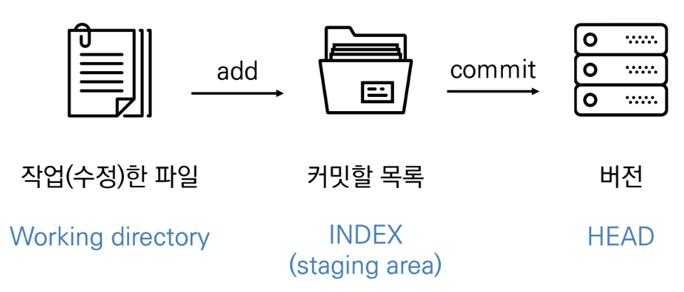

Day2 
# **인터페이스 (Interface)**

## 프롬프트(터미널) 기본 인터페이스 
- 컴퓨터 정보 - 디렉토리 $

## **종류**

> ###  **CLI** (명령어 인터페이스, 커멘드 라인 인터페이스)
- 가상 터미널 또는 텍스트 터미널을 통해 사용자와 컴퓨터가 **상호작용**하는 방식
- 작업 **명령** => 사용자가 툴바 키보드 등을 통해 **문자열**의 형태로 입력
- 컴퓨터로부터의 **출력** => **문자열**의 형태
- 셀(명령 줄 해석기) : 인터페이스를 제공하는 프로그램 
    - 예) 유닉스 셀(sh, ksh, csh, tcsh, bash) , CP/M, 도스의 command.com("명령 프롬프트”)

- **명령어**
    - **pwd** : 현재 디렉토리 출력
    - **ls** : 목록(list)
    - **mkdir** : 디렉토리 생성 (make directory)
    - **cd 디렉토리 이름**: 디렉토리 이동 (change directory)
        - **..** : 상위 디렉토리
        - **.** : 현재 디렉토리
    - **touch 파일명** : 새로운 파일 생성
    - **rm 파일명** : 파일 삭제
    - **rm -r 폴더명** : 폴더 삭제 

> ### **GUI** (그래픽 인터페이스)
 

---

# **버전 관리** (= 소스코드 관리)
## 개념
- **동일한 정보**에 대한 **여러 버전**을 관리하는 것
    - 버전 : 컴퓨터 소프트웨어 상태
        
        [참고사이트](https://www.google.com/url?q=https://en.wikipedia.org/wiki/Version_control&sa=D&source=apps-viewer-frontend&ust=1672215127636396&usg=AOvVaw25LYqyUl1KKqZ8J0WMJrB0&hl=ko)

## 예시
> ### 네이버의 홈페이지 소스코드 버전 관리
- 1999년 설립된 네이버
- 매일 업데이트된다고 할때, 모든 소스코드를 복제해서 관리하고 있을까?

> ###  오픈소스(크로미움)
- 크로미움(크롬 브라우저의 오픈소스)
- 최신 버전의 용량 1.58GB
- 현재까지 1,000,000여개의 커밋(버전) 20,000여개의 릴리즈
- 모든 버전의 용량 => 25GB 하나의 폴더 => 버전 관리 해주는 ***git*** 덕분!

> ### Google Document 버전 관리
- 문서는 하나, but 버전이 기록되어 있으면, 이전 시점 조회, 복원 가능

 

## 버전 관리 시스템

> ### 중앙 집중식 버전관리 시스템
- 로컬에서는 파일 편집, 서버에 반영
- 중앙 서버에서만 버전 관리

> ### **분산버전관리시스템(DVCS)**
- 로컬에서도 버전 기록하고 관리
- 원격 저장소를 활용하여 협업

 

# **GIt**
- **분산버전 관리시스템**으로 코드의 버전을 관리하는 도구
- 컴퓨터 파일의 **변경사항**을 **추적**하고 여러 명의 **사용자들 간**에 파일들의 **작업**을 조율
- **기본 명령어**
    - **$ git init**
        - 특정 폴더를 **git저장소(repository)**를 **생성**해(초기화) git로 관리

## **버전 기록** 
- 기본 흐름

**1. 작업을 하고, 2. 변경된 파일을 모아(add) 3. 버전으로 남긴다.(commit)**
- git **add** 보고서.md => git **commit** -m ‘보고서’ => git **status** / git **log**

 

- **사용법**
    - **$ git add <file>** 
        - Working directory상의 **변경내용**을 **staging area에 추가**하기 위해 사용
    - **$ git commit -m ‘<커밋 메시지>’**
        - Staged 상태의 파일들을 커밋을 통해 **버전**으로 **기록**
        - 커밋 메시지는 변경사항을 나타낼 수 있도록 명확하게 작성해야 함.
    - **$ git log**
        - **버전** 확인
    - **$ git status**
        - **상태** 확인
        